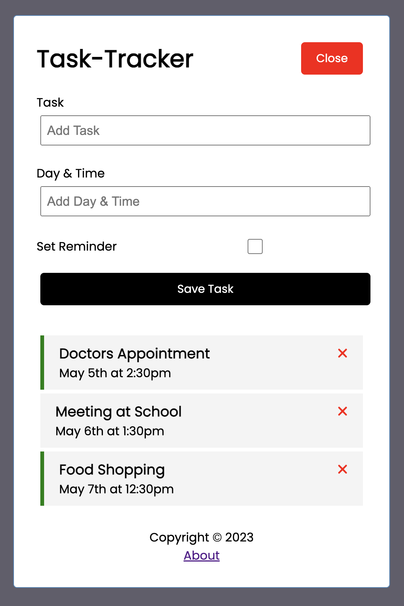

# Task-Tracker: A Project in Angular

Task-Tracker is a simple, yet powerful project designed to help you keep track of your tasks. It was built using [Angular CLI](https://github.com/angular/angular-cli) version 16.1.4, with the primary objective of improving my understanding of the Angular framework, its methodologies and best practices.

This project uses:

- **CRUD operations** with a locally setup backend using JSON-server.
- The **Angular Router** for smooth page transitions.
- Styling and icons from **fortawesom/angular-font-awesome v6** for a modern UI.

**Features:**

- Easy tracking of tasks with changeable reminder indicators.
- Persistent data across page refreshes.

## Installation and Setup

Follow these steps to get Task-Tracker up and running on your machine:

1. Clone the project to your local directory by running `git clone https://github.com/austinschroeder/angular-learn.git`
2. Install dependencies by running `npm i`
3. The project works best with Node versions `v14.20`, `v16.14`, or `v18.10` (as per the Angular docs)

## Running Locally

- Run `npm run server` for a local dev server.
- Run `ng serve` to spin up the local environment.
- Navigate to `http://localhost:4200/` to interact with the app.

_Note: Double click on tasks to change the reminder indicator._

## Contributing

While this project is mainly for my learning, I'm open to suggestions and contributions. Feel free to raise issues or make pull requests.
